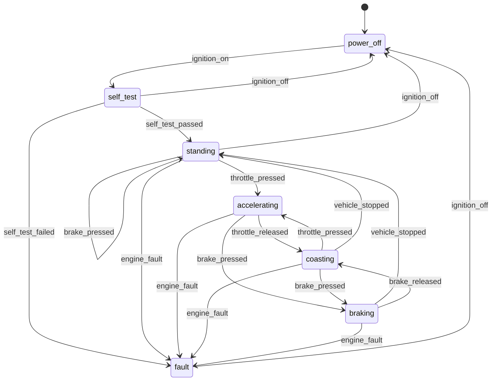

# fms-yaml

A finite state machine described entirely by a YAML file, built on the
[Embedded Template Library](https://github.com/ETLCPP/etl), driven over MQTT
through a thin abstraction over [paho.mqtt.c](https://github.com/eclipse/paho.mqtt.c).

The whole behaviour, in one line:

> **A trigger the current state lists changes the state. Anything else is an
> error, reported back over MQTT.**

No guards, no actions, no parameters, no timers, no nesting.

| Constraint | How it is met |
|---|---|
| States and triggers come from a config file | `fms::config::load_file` builds the model from YAML; there is nothing to register in code |
| Built on ETL | `etl::flat_map`, `etl::vector`, `etl::string` throughout |
| States and triggers stored with their dependencies in a flat map | `flat_map<StateId, StateNode>`, and inside each node `flat_map<TriggerId, StateId>` |
| No dynamic allocation after setup | fixed capacities from `fms/limits.hpp`; proven by `tests/test_no_alloc.cpp`, which replaces global `operator new` and traps it |
| No exceptions | everything is compiled `-fno-exceptions`; the one TU that talks to yaml-cpp is the exception firewall and returns `Status` |
| MQTT in and out via paho | `fms::mqtt::ITransport` is the seam; `PahoTransport` and `LoopbackTransport` implement it |

## Build

```sh
cmake -S . -B build -DCMAKE_BUILD_TYPE=Release
cmake --build build -j
ctest --test-dir build --output-on-failure
```

Dependencies (ETL 20.39.4, yaml-cpp 0.8.0, paho.mqtt.c 1.3.13, doctest 2.4.11)
are fetched automatically. `-DFMS_FETCH_DEPS=OFF` uses installed copies,
`-DFMS_WITH_PAHO=OFF` builds without a broker binding.

## The car machine



Which subsystem raises what:

| Subsystem | Topics | Triggers |
|---|---|---|
| ignition switch | `car/ignition/on`, `car/ignition/off` | `ignition_on`, `ignition_off` |
| self test unit | `car/selftest/passed`, `car/selftest/failed` | `self_test_passed`, `self_test_failed` |
| engine | `car/engine/throttle_pressed`, `car/engine/throttle_released`, `car/engine/fault` | `throttle_pressed`, `throttle_released`, `engine_fault` |
| brake system | `car/brakes/pressed`, `car/brakes/released` | `brake_pressed`, `brake_released` |
| wheel speed sensors | `car/wheels/stopped` | `vehicle_stopped` |

Anything not drawn above is rejected. The brakes may report a release while the
car is standing; the machine says no and publishes why, rather than inventing a
state for it.

## Run the car example

```sh
mosquitto &                          # any broker on tcp://localhost:1883
./build/car_ecu build/car.yaml

mosquitto_sub -t 'car/#' -v
mosquitto_pub -t car/ignition/on -n
mosquitto_pub -t car/selftest/passed -n
mosquitto_pub -t car/engine/throttle_pressed -n
mosquitto_pub -t car/brakes/pressed -n
```

```
loaded 'car': 7 states, 10 triggers
running as 'car-ecu-01' in state 'power_off' - ctrl-c to stop
[car] power_off     rejected 'brake_released'
[car] power_off     --ignition_on--> self_test
[car] self_test     --self_test_passed--> standing
[car] standing      --throttle_pressed--> accelerating
[car] accelerating  rejected 'vehicle_stopped'
[car] accelerating  --brake_pressed--> braking
[car] braking       --vehicle_stopped--> standing
```

What the broker sees:

```
car/state  power_off
car/error  rejected: brake_released in state power_off
car/state  self_test
car/state  standing
car/state  accelerating
car/error  rejected: vehicle_stopped in state accelerating
car/state  braking
```

## Configuration

Each subsystem owns its topics; a message on a trigger's topic raises that
trigger. The payload is not looked at. Full schema in
[docs/schema.md](docs/schema.md).

```yaml
fsm:
  name: car
  initial: power_off

mqtt:
  broker: "tcp://localhost:1883"
  client_id: "car-ecu-01"
  state_topic: "car/state"     # every state change is published here
  error_topic: "car/error"     # rejected triggers are reported here

triggers:
  - {name: ignition_on,      topic: "car/ignition/on"}
  - {name: brake_pressed,    topic: "car/brakes/pressed"}
  - {name: throttle_pressed, topic: "car/engine/throttle_pressed"}
  - {name: vehicle_stopped,  topic: "car/wheels/stopped"}

states:
  - name: power_off
    transitions:
      ignition_on: self_test          # trigger: next state
  - name: standing
    transitions:
      throttle_pressed: accelerating
  - name: accelerating
    transitions:
      brake_pressed: braking
  - name: braking
    transitions:
      vehicle_stopped: standing
```

## Using it

```cpp
fms::Model model;
fms::config::Diagnostics diag;
if (!fms::is_ok(fms::config::load_file("car.yaml", model, diag))) {
  std::fprintf(stderr, "line %d: %s\n", diag.line, diag.message.c_str());
  return 1;
}

fms::mqtt::PahoTransport transport;
transport.open(model.mqtt());

fms::StateMachine machine;
machine.init(model);

fms::Runtime runtime;
runtime.init(model, machine, transport);
runtime.start();          // connect, subscribe, publish the initial state

while (running) {         // no allocation past this point
  runtime.service(100);
}
runtime.stop();
```

Firing a trigger directly, without MQTT:

```cpp
fms::TransitionEvent event;
switch (machine.fire(model.find_trigger("brake_pressed"), event)) {
  case fms::Status::Ok:           /* event.from -> event.to */ break;
  case fms::Status::NoTransition: /* rejected in event.from */ break;
  default: break;
}
```

## Data layout

```
Model
├── states_        flat_map<StateId, StateNode>    a state and its dependencies
│   └── StateNode
│       ├── name         Name
│       └── transitions  flat_map<TriggerId, StateId>
├── state_index_   flat_map<Name, StateId>         name resolution, load time only
├── triggers_      flat_map<TriggerId, TriggerDef> a trigger and its topic
├── trigger_index_ flat_map<Name, TriggerId>
└── topic_index_   flat_map<Topic, TriggerId>      inbound MQTT routing
```

Firing a trigger is one binary search in the current state's transition map.
A hit is the next state; a miss is the error. That is the entire engine —
`StateMachine::fire()` is about twenty lines.

## Layout

```
include/fms/
  limits.hpp          compile-time capacities (override with -DFMS_MAX_STATES=…)
  model.hpp           the flat-map machine description
  state_machine.hpp   init / start / fire
  runtime.hpp         MQTT <-> FSM glue, publishes states and rejections
  yaml_loader.hpp     config front end (the exception firewall)
  alloc_guard.hpp     optional heap trap
  mqtt/transport.hpp  the abstraction; paho_transport.hpp, loopback_transport.hpp
src/                  implementations (src/config/yaml_loader.cpp is the only -fexceptions TU)
examples/car/         car.yaml + a main() that adds no behaviour of its own
tests/                doctest suites, including the no-allocation proof
docs/                 schema.md, architecture.md
```
