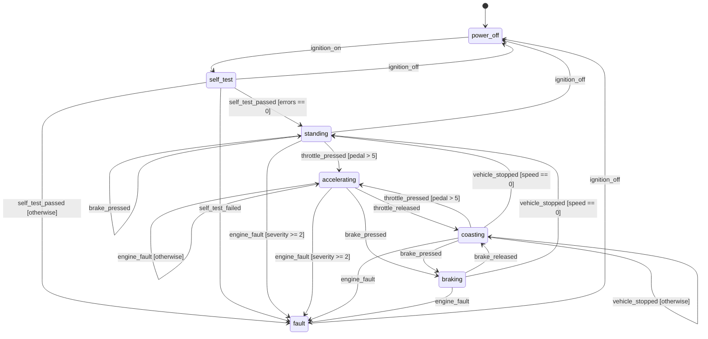

# fms-yaml

[](https://github.com/subtilitas/fms-yaml/actions/workflows/ci.yml)
[](https://github.com/subtilitas/fms-yaml/actions/workflows/codeql.yml)
[](https://github.com/subtilitas/fms-yaml/actions/workflows/sanitizers.yml)
[](https://github.com/subtilitas/fms-yaml/actions/workflows/lint.yml)
[](https://codecov.io/gh/subtilitas/fms-yaml)
[](https://github.com/subtilitas/fms-yaml/wiki)

A finite state machine described entirely by a YAML file, built on the
[Embedded Template Library](https://github.com/ETLCPP/etl).

> **A trigger the current state lists, whose guard holds, changes the state.
> Anything else is an error, reported back to whoever is listening.**

Triggers carry `key=value` arguments; guards are declarative comparisons
against them. No actions, no timers, no nesting, no application code in the
decision.

| Constraint | How it is met |
|---|---|
| States, triggers and guards come from a config file | two files: a **machine** file (triggers, states, guards) and a **setup** file (everything else); nothing to register in code |
| Built on ETL | `etl::flat_map`, `etl::vector`, `etl::string` throughout |
| States and triggers stored with their dependencies in a flat map | `flat_map<StateId, StateNode>`, and inside each node `flat_map<TriggerId, Alternatives>` |
| No dynamic allocation after setup | fixed capacities from `fms/limits.hpp`; `tests/test_no_alloc.cpp` replaces global `operator new` and traps it |
| One capacity configuration per program | `cmake -DFMS_MAX_STATES=8` reaches every target; a translation unit that disagrees fails to link as soon as it builds a `Model`, `Setup`, `Args` or `Runtime` (`fms/abi.hpp`) |
| No exceptions | compiled `-fno-exceptions`; the one TU that talks to yaml-cpp is the firewall and returns `Status` |
| Interface left open | `fms::IPort` is eight virtual methods; the shipped implementations are a console port and an in-memory test port |
| Config is a run-time input | the build never opens the YAML; `--check` validates a config by running the binary |

## Build

```sh
cmake -S . -B build -DCMAKE_BUILD_TYPE=Release
cmake --build build -j
ctest --test-dir build --output-on-failure
```

Dependencies: ETL 20.39.4, yaml-cpp 0.8.0, and doctest 2.4.11 for the tests.
Fetched automatically; `-DFMS_FETCH_DEPS=OFF` uses installed copies.

What a version number promises — which headers are the public interface, what
is deliberately not covered, and which toolchains move only with a breaking
version — is in [docs/stability.md](docs/stability.md). Changes per release are
in [CHANGELOG.md](CHANGELOG.md), how to work on it in
[CONTRIBUTING.md](CONTRIBUTING.md), and what counts as a vulnerability in
[SECURITY.md](SECURITY.md).

Targets: `fms_core` (the machine, no transport), `fms_config` (the YAML loader,
optional), `fms_console` (the `<iostream>` port, optional), `fms_inspect`
(linter and diagram exporter, optional), `fms_alloc_guard` (optional). Nothing
in `fms_inspect` is reachable from the run phase, so a firmware build links
`fms_core` and stops there.

`-DFMS_BUILD_CONFIG=OFF` drops the loader, and with it yaml-cpp, the filesystem
and the one translation unit that uses exceptions. That is the shape a target
build takes — `cmake/arm-none-eabi.cmake` and `tools/cross_check.sh` compile it
for a Cortex-M4 with no operating system on every push. It needs a hosted C++
library such as newlib's, because ETL includes `<math.h>`; the toolchain file
records why.

## Installing

`add_subdirectory` works as it is and fetches its own dependencies. To install
instead, install ETL and yaml-cpp first — an exported target cannot refer to a
dependency built inside the same tree, which is why `FMS_INSTALL` requires
`FMS_FETCH_DEPS=OFF` and says so rather than failing later:

```sh
cmake -S . -B build -DFMS_FETCH_DEPS=OFF -DFMS_INSTALL=ON -DFMS_BUILD_TESTS=OFF \
      -DCMAKE_PREFIX_PATH=/opt/deps -DCMAKE_INSTALL_PREFIX=/opt/fms
cmake --build build -j
cmake --install build
```

`FMS_BUILD_TESTS=OFF` because the suite needs doctest, and `FMS_FETCH_DEPS=OFF`
means nothing is downloaded — install doctest as well and the tests build here
too.

Then, in another project:

```cmake
find_package(fms_yaml REQUIRED)
target_link_libraries(app PRIVATE fms::core fms::config)
```

The installed targets are named as the in-tree aliases are — `fms::core`,
`fms::config`, `fms::console`, `fms::inspect`, `fms::alloc_guard` — and only
those that were built are exported. They carry the capacities the library was
built with, so a consumer inherits them rather than having to know they exist.

`tools/install_check.sh` does the whole sequence, including the two
dependencies at their pinned versions, and ends by building `tests/consumer`
against the result. It is the `install` CI job, so a local run is the run that
gates the build.

`car_console --version` reports the version and the capacities:

```
$ ./build/car_console --version
fms-yaml 1.0.0 (capacities 32_32_8_4_3_64_4_31_95_127_32)
```

The version comes from `fms/version.hpp`, which CMake generates from
`project()`. It is not in the source tree and not committed: one declaration,
so a header and a release tag cannot say different things.

## Run the car example

Both paths default to the working directory:

```sh
./build/car_console examples/car/car.setup.yaml examples/car/car.machine.yaml
cd examples/car && ../../build/car_console
```

`car_console` reads trigger names from `std::cin`, writes states to
`std::cout`, and errors plus the transition trace to `std::cerr`:

```
$ ./build/car_console examples/car/car.setup.yaml examples/car/car.machine.yaml
car-ecu-01 running 'car': 7 states, 10 triggers - type 'help' or 'quit'
state: power_off
> ignition_on
  [power_off --ignition_on--> self_test]
state: self_test
> self_test_passed errors=2          ← the guard says errors must be 0
  [self_test --self_test_passed--> fault]
state: fault
> ignition_off
state: power_off
> ignition_on
> self_test_passed errors=0
state: standing
> throttle_pressed pedal=60
state: accelerating
> brake_pressed
state: braking
> vehicle_stopped speed=20
error: rejected: vehicle_stopped in state braking: no guard matched (speed=20)
> handbrake
error: unknown channel: handbrake
> quit
```

It pipes, which is how the `car_console_pipe` test drives it:

```sh
printf 'ignition_on\nself_test_passed errors=0\nthrottle_pressed pedal=60\n' \
  | ./build/car_console --quiet
state: power_off
state: self_test
state: standing
state: accelerating
```

Swapping the setup file redeploys the same machine elsewhere:

```sh
./build/car_console bench.setup.yaml car.machine.yaml   # same machine, starts in standing
```

## Validating a config

`--check` loads both files, reports what they describe, lints the result and
exits. Exit status is 1 if the linter found an error.

```sh
$ ./build/car_console examples/car/car.setup.yaml examples/car/car.machine.yaml --check
setup   : instance 'car-ecu-01', starts in 'power_off'
machine : 'car', 7 states, 10 triggers, 7 guard conditions
  power_off     * 1 trigger(s) ignition_on
  self_test       3 trigger(s) ignition_off self_test_passed(2) self_test_failed
  standing        4 trigger(s) ignition_off throttle_pressed(2) engine_fault(2) brake_pressed
  ...
lint    : clean
ok
```

A number in brackets is how many guarded alternatives that trigger has. A bad
file fails here rather than at the first trigger:

```
$ ./build/car_console car.setup.yaml broken.machine.yaml --check
broken.machine.yaml: unknown state at line 50: target state 'nowhere' does not exist
```

## What a valid file can still get wrong

The loader answers one question: is this a valid description? A file can pass
all of it and still describe a machine nobody meant. Those are not file errors,
so a second pass runs over the loaded machine — `--lint` alone, or `--check`
after the description.

```
$ ./build/car_console broken.setup.yaml broken.machine.yaml --lint
lint    : 6 finding(s)
  error   unreachable-state       state 'orphan' cannot be reached from the initial state
  error   unreachable-state       state 'terminal' cannot be reached from the initial state
  warning dead-end-state          state 'terminal' has no transition to another state
  warning unused-trigger          trigger 'never_used' is declared but no state lists it
  error   impossible-guard        state 'idle', trigger 'go', alternative 1: the guard can never hold (pedal > 60 and pedal < 5)
  error   unreachable-alternative state 'idle', trigger 'go', alternative 4: alternative 3 has no guard, so nothing after it is reached
```

| Check | | Why |
|---|---|---|
| `unreachable-state` | error | no sequence of triggers leads there from `fsm.initial` |
| `unreachable-alternative` | error | it comes after an unguarded one, which always holds |
| `impossible-guard` | error | the ANDed conditions contradict each other |
| `shadowed-alternative` | error | an earlier alternative holds every time this one would |
| `dead-end-state` | warning | nothing leads out of it — often a terminal state |
| `unused-trigger` | warning | declared, but no state lists it: input on its channel is always refused |

Severity belongs to the check, not to the machine: the warnings can be exactly
what was meant. Reachability ignores guards — whether `errors == 0` ever holds
is a question about the sender, not the file. The guard checker reports only
what it can prove; details in
[docs/architecture.md](docs/architecture.md#the-linter).

## The car machine

`--export mermaid|dot` renders the loaded machine, one edge per alternative
labelled with its trigger and guard. An unguarded alternative among several is
labelled `[otherwise]`, because file order is what makes it the fallback and
order is the one thing a diagram cannot show.

```sh
./build/car_console car.setup.yaml car.machine.yaml --export mermaid
./build/car_console car.setup.yaml car.machine.yaml --export dot | dot -Tsvg > car.svg
```

The block below is that output, spliced in by `tools/diagram_sync.py --write`.
The `car_diagram_check` test regenerates it and fails on drift, so a machine
change that was not redrawn is a red build rather than a picture that lies.

<!-- diagram:begin -->


<sub>Generated from the machine file by `tools/diagram_sync.py`, and checked by the
`car_diagram_check` test.  Change the YAML, then run `python3 tools/diagram_sync.py --write`.</sub>
<!-- diagram:end -->

Anything not drawn is rejected and reported, rather than inventing a state for
it.

## Configuration

The **machine** file is behaviour; the **setup** file is deployment. Full
schema in [docs/schema.md](docs/schema.md).

`car.machine.yaml`:

```yaml
fsm:
  name: car                     # the definition

triggers:
  - {name: ignition_on}                          # listens on its own name
  - {name: brake_pressed, channel: "car/brakes"} # ...or wherever you say
  - {name: self_test_passed}                     # carries errors=<count>
  - {name: throttle_pressed}                     # carries pedal=<0..100>

states:
  - name: power_off
    transitions:
      ignition_on: self_test    # plain: trigger -> next state

  - name: self_test
    transitions:
      self_test_passed:         # guarded alternatives, in order
        - {when: "errors == 0", target: standing}
        - {target: fault}       # no `when`: the fallback

  - name: standing
    transitions:
      throttle_pressed:         # resting a foot on the pedal is not pulling away
        - {when: "pedal > 5", target: accelerating}
        - {target: standing}
```

`car.setup.yaml`:

```yaml
fsm:
  name: car-ecu-01              # this instance
  initial: power_off            # where it starts

io:
  state_channel: "car/state"    # where the machine announces its state
  error_channel: "car/error"    # where it reports refused triggers
  endpoint: "tcp://localhost:1883"   # opaque, for whatever port you plug in
  identity: "car-ecu-01"
```

A **channel** is an opaque address the port understands: a word on stdin, an
MQTT topic, a CAN identifier, a UDP port. The core matches it and never
interprets it. Omit it and the trigger listens on its own name.

A **guard** is one comparison against one argument — `==` `!=` `<` `<=` `>`
`>=`, over integers or text. Several conditions under one `when` are ANDed;
several alternatives are ORed. Guards are parsed at load time, so `when:
"pedal"` is a config error with a line number, and a missing argument makes the
guard false — a guard decides, it never fails.

Each loader rejects the other's sections, naming the file the section belongs
in.

## Using it

```cpp
fms::Setup setup;
fms::Model model;
fms::config::Diagnostics diag;

if (!fms::is_ok(fms::config::load_setup_file("car.setup.yaml", setup, diag)) ||
    !fms::is_ok(fms::config::load_machine_file("car.machine.yaml", model, diag))) {
  std::fprintf(stderr, "line %d: %s\n", diag.line, diag.message.c_str());
  return 1;
}

fms::port::ConsolePort port;      // or your own IPort

fms::StateMachine machine;
machine.init(model, setup);       // binds the two halves; checks fsm.initial exists

fms::Runtime runtime;
runtime.init(machine, port);      // model and setup come from the machine
runtime.start();                  // configure, open, listen, publish the initial state

for (;;) {                        // no allocation past this point
  const fms::Status s = runtime.service();
  if (s == fms::Status::EndOfInput || !fms::is_ok(s)) break;
}
runtime.stop();
```

Or drive the machine directly, with no port:

```cpp
fms::Args args;
args.parse("pedal=60");                      // views into your buffer, no copy

fms::TransitionEvent event;
switch (machine.fire(model.find_trigger("throttle_pressed"), args, event)) {
  case fms::Status::Ok:            /* event.from -> event.to */    break;
  case fms::Status::GuardRejected: /* listed, but no guard held */ break;
  case fms::Status::NoTransition:  /* not listed in this state */  break;
  default: break;
}
```

## Plugging in another interface

`fms::IPort` is the only thing between the machine and the world — eight
methods, five with usable defaults. Implement it and the machine works over
MQTT, CAN, a socket or a serial line:

```cpp
class MyPort final : public fms::IPort {
  fms::Status configure(const fms::IoConfig& io) noexcept override;  // optional
  fms::Status open() noexcept override;                              // optional
  fms::Status listen(fms::StringView channel) noexcept override;     // optional
  fms::Status receive(fms::Input& in, std::uint32_t ms) noexcept override;
  fms::Status publish_state(fms::StringView state) noexcept override;
  fms::Status publish_error(fms::StringView message) noexcept override;
  fms::Status close() noexcept override;                             // optional
};
```

No method may throw or allocate; `receive()` is the only one that may block,
and the views it returns must stay valid until the next call on the port.
`io.endpoint` and `io.identity` reach you untouched. Full contract in
[docs/architecture.md](docs/architecture.md#writing-a-port).

## Data layout

```
Setup                                              the deployment
├── name           Name                            this instance
├── initial_       Name                            resolved against the model at init
└── io_            IoConfig                        channels + two opaque strings

Model                                              the behaviour
├── states_        flat_map<StateId, StateNode>    a state and its dependencies
│   └── StateNode
│       ├── name         Name
│       └── transitions  flat_map<TriggerId, Alternatives>
│                          Alternative{first_condition, count, target}
├── conditions_    vector<Condition>               machine-wide guard pool
├── state_index_   flat_map<Name, StateId>         name resolution, load time only
├── triggers_      flat_map<TriggerId, TriggerDef> a trigger and its channel
├── trigger_index_ flat_map<Name, TriggerId>
└── channel_index_ flat_map<Channel, TriggerId>    inbound routing
```

Firing a trigger is one binary search in the current state's transition map,
then the alternatives in file order until a guard holds. Conditions are interned
in one pool and referenced by index, so an `Alternative` is 6 bytes rather than
two fixed-size strings; without that a full `Model` would be hundreds of
kilobytes.

## Quality gates

Every push runs the same gates, each answering a question the others cannot.
What they add up to, and what is not covered, is in
[docs/testing.md](docs/testing.md).

| Gate | Tool | Where |
|---|---|---|
| Build + tests | GCC and Clang on Linux, MSVC on Windows | `ci.yml` → `build` |
| Coverage | `gcovr`, published to codecov.io | `ci.yml` → `coverage` |
| Static analysis | `clang-tidy` (`.clang-tidy`), over `src`, `tests` and `examples` | `ci.yml` → `clang-tidy` |
| Static analysis | `cppcheck` (`.cppcheck-suppressions`) | `ci.yml` → `cppcheck` |
| Tooling | `ruff` (`ruff.toml`), `shellcheck`, `actionlint` | `lint.yml` |
| Runtime analysis | ASan + UBSan over the test suite | `sanitizers.yml` |
| Configuration | the shipped YAML loaded and linted by the real binary | `ctest` → `car_config_check` |
| Documentation | the README's diagram regenerated and compared | `ctest` → `car_diagram_check` |
| Documentation | the type sizes the pages quote, measured against the build | `ctest` → `doc_figures` |
| Capacity ABI | a probe built with a changed capacity must fail to link | `ctest` → `abi_guard` |
| No exceptions, no allocation | read out of the built archives with `nm`, not inferred from the flags | `ctest` → `symbol_check` |
| Bare metal | `fms_core` and `fms_inspect` compiled for a Cortex-M4 with no OS | `ci.yml` → `cross` |
| Capacities | the suite built and run at three configurations, not just the defaults | `ci.yml` → `capacities` |
| Packaging | install it, then build a consumer that knows it only through `find_package` | `ci.yml` → `install` |
| Deep static analysis | CodeQL (`security-and-quality`) over a real build | `codeql.yml` |

Both analysers run through `tools/analyze.sh`, so the flags exist once and a
local run is the run that gates the build:

```sh
bash tools/analyze.sh              # clang-tidy, cppcheck, and the tooling lint
bash tools/analyze.sh clang-tidy   # just one of them
```

A tool that is not installed fails the run rather than being skipped: a gate
that could not run has not passed. That is also why the clang-tidy step is a
script — it pipes into `tee`, and a workflow `run:` block gets `bash -e`
without `pipefail`, so the step would report `tee`'s exit code, always zero.

Reproduce the coverage run as CI does it:

```sh
pip install gcovr
bash tools/coverage.sh            # build, test, HTML report, per-file summary
```

Reporting goes to [codecov.io](https://codecov.io/gh/subtilitas/fms-yaml);
nothing is written back into the tree. The floor stays here — the coverage job
runs `tools/coverage_report.py --fail-under 90` — because a threshold
configured in a service is one a reader cannot find and a fork does not
inherit.

The two numbers differ by construction. Both measure `src/` and `include/fms/`
(`gcovr.cfg` decides that, and `disable_search` pins the upload to the report
gcovr wrote), but codecov counts a partially taken branch as a partial line
while the floor tests plain line coverage, so the badge reads lower.

Line coverage is portable; branch coverage is not. It counts the edges the
compiler emitted, so it compares only within one toolchain: one tree measured
72.2% branches under GCC 13 and 68.9% under GCC 11, with line coverage
identical in both. CI's GCC is the reference.

## Layout

```
include/fms/
  limits.hpp          compile-time capacities (override with -DFMS_MAX_STATES=…)
  abi.hpp             makes a capacity mismatch a link error, not a corrupt Model
  version.hpp         generated by CMake from project(); not in the source tree
  model.hpp           the machine: triggers, states and guarded alternatives
  args.hpp            key=value arguments, as views over the port's buffer
  condition.hpp       one guard: arg, operator, literal
  setup.hpp           the deployment: name, initial state, io
  io_config.hpp       the io block, so a port can see it without seeing the model
  state_machine.hpp   init / start / fire
  runtime.hpp         port <-> FSM glue, publishes states and rejections
  port.hpp            the interface to the outside world
  port/console_port.hpp   std::cin / std::cout
  port/memory_port.hpp    in-memory, for tests
  yaml_loader.hpp     both config front ends (the exception firewall)
  alloc_guard.hpp     optional heap trap
  inspect/lint.hpp    what is wrong with a machine that still loads
  inspect/diagram.hpp the machine as mermaid or graphviz
src/                  implementations (src/config/yaml_loader.cpp is the only -fexceptions TU)
examples/car/         car.setup.yaml + car.machine.yaml + a main() that adds no behaviour
tests/                doctest suites, the no-allocation proof, and a scripted console session
tests/consumer/       a project that knows the library only through find_package
tools/                the scripts the quality gates run
cmake/                the package config template, and an arm-none-eabi toolchain file
docs/                 schema.md, architecture.md, stability.md, testing.md
```

---

In collaboration with Claude Code.
