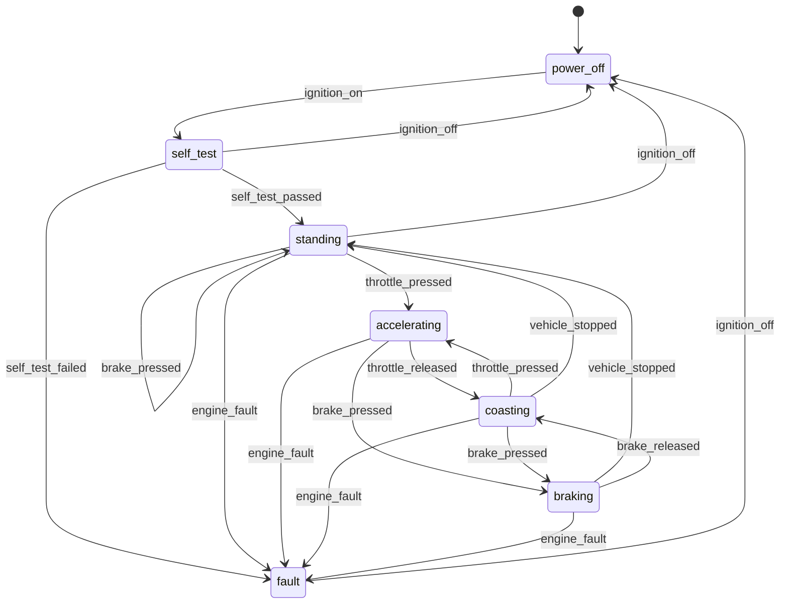

# fms-yaml

A finite state machine described entirely by a YAML file, built on the
[Embedded Template Library](https://github.com/ETLCPP/etl).

The whole behaviour, in one line:

> **A trigger the current state lists, whose guard holds, changes the state.
> Anything else is an error, reported back to whoever is listening.**

Triggers may carry `key=value` arguments, and guards are declarative comparisons
against them — so the configuration stays the only description of the machine.
No actions, no timers, no nesting, and no application code in the decision.

| Constraint | How it is met |
|---|---|
| States, triggers and guards come from a config file | two files: a **machine** file (triggers, states, guards) and a **setup** file (everything else); there is nothing to register in code |
| Built on ETL | `etl::flat_map`, `etl::vector`, `etl::string` throughout |
| States and triggers stored with their dependencies in a flat map | `flat_map<StateId, StateNode>`, and inside each node `flat_map<TriggerId, StateId>` |
| No dynamic allocation after setup | fixed capacities from `fms/limits.hpp`; proven by `tests/test_no_alloc.cpp`, which replaces global `operator new` and traps it |
| No exceptions | everything is compiled `-fno-exceptions`; the one TU that talks to yaml-cpp is the exception firewall and returns `Status` |
| Interface left open | the core has no transport dependency at all — `fms::IPort` is six virtual methods, and the shipped implementations are a console port and an in-memory test port |

## Build

```sh
cmake -S . -B build -DCMAKE_BUILD_TYPE=Release
cmake --build build -j
ctest --test-dir build --output-on-failure
```

Dependencies: ETL 20.39.4 and yaml-cpp 0.8.0, plus doctest 2.4.11 for the tests.
They are fetched automatically; `-DFMS_FETCH_DEPS=OFF` uses installed copies.

## Run the car example

`car_console` reads trigger names from `std::cin` and writes state changes to
`std::cout`:

```
$ ./build/car_console car.setup.yaml car.machine.yaml
car-ecu-01 running 'car': 7 states, 10 triggers - type 'help' or 'quit'
state: power_off
> ignition_on
  [power_off --ignition_on--> self_test]
state: self_test
> self_test_passed errors=2          ← the guard says errors must be 0
  [self_test --self_test_passed--> fault]
state: fault
> ignition_off
state: power_off
> ignition_on
> self_test_passed errors=0
state: standing
> throttle_pressed pedal=3           ← not enough pedal to pull away
state: standing
> throttle_pressed pedal=60
state: accelerating
> brake_pressed
state: braking
> vehicle_stopped speed=20
error: rejected: vehicle_stopped in state braking: no guard matched (speed=20)
> handbrake
error: unknown channel: handbrake
> quit
```

It pipes just as well, which is how the `car_console_pipe` test drives it:

```sh
printf 'ignition_on\nself_test_passed errors=0\nthrottle_pressed pedal=60\n' \
  | ./build/car_console --quiet
state: power_off
state: self_test
state: standing
state: accelerating
```

State goes to stdout, errors and the transition trace to stderr, so the two are
easy to separate.

The setup file is the only thing that changes between deployments, so the same
machine can be started somewhere else entirely by swapping it:

```sh
./build/car_console bench.setup.yaml car.machine.yaml   # same machine, starts in standing
```

## The car machine



Which subsystem raises what:

| Subsystem | Triggers |
|---|---|
| ignition switch | `ignition_on`, `ignition_off` |
| self test unit | `self_test_passed`, `self_test_failed` |
| engine | `throttle_pressed`, `throttle_released`, `engine_fault` |
| brake system | `brake_pressed`, `brake_released` |
| wheel speed sensors | `vehicle_stopped` |

Anything not drawn above is rejected. The brakes may report a release while the
car is standing; the machine says no and reports why, rather than inventing a
state for it.

## Configuration

Two files. The **machine** is behaviour — triggers and states, nothing about
where it runs. The **setup** is everything else: which instance this is, where
it starts, how it talks. Full schema in [docs/schema.md](docs/schema.md).

`car.machine.yaml`:

```yaml
fsm:
  name: car                     # the definition

triggers:
  - {name: ignition_on}                          # listens on its own name
  - {name: brake_pressed, channel: "car/brakes"} # ...or wherever you say
  - {name: self_test_passed}                     # carries errors=<count>
  - {name: throttle_pressed}                     # carries pedal=<0..100>

states:
  - name: power_off
    transitions:
      ignition_on: self_test    # plain: trigger -> next state

  - name: self_test
    transitions:
      self_test_passed:         # guarded alternatives, in order
        - {when: "errors == 0", target: standing}
        - {target: fault}       # no `when`: the fallback

  - name: standing
    transitions:
      throttle_pressed:         # resting a foot on the pedal is not pulling away
        - {when: "pedal > 5", target: accelerating}
        - {target: standing}
```

`car.setup.yaml`:

```yaml
fsm:
  name: car-ecu-01              # this instance
  initial: power_off            # where it starts

io:
  state_channel: "car/state"    # where the machine announces its state
  error_channel: "car/error"    # where it reports refused triggers
  endpoint: "tcp://localhost:1883"   # opaque, for whatever port you plug in
  identity: "car-ecu-01"
```

A **channel** is an opaque address the port understands: a word typed on stdin,
an MQTT topic, a CAN identifier, a UDP port. The core never interprets it — it
only matches it. Omit it and the trigger listens on its own name.

A **guard** is one comparison against one argument: `==` `!=` `<` `<=` `>` `>=`,
over integers or text. List several conditions under one `when` to AND them,
write several alternatives to OR them. Guards are parsed at load time, so
`when: "pedal"` is a config error with a line number rather than a run-time
surprise, and a missing argument simply makes the guard false — a guard decides,
it never fails.

Each loader rejects the other's sections, so a stray `states:` in the setup file
is caught with a message saying where it belongs.

## Using it

```cpp
fms::Setup setup;
fms::Model model;
fms::config::Diagnostics diag;

if (!fms::is_ok(fms::config::load_setup_file("car.setup.yaml", setup, diag)) ||
    !fms::is_ok(fms::config::load_machine_file("car.machine.yaml", model, diag))) {
  std::fprintf(stderr, "line %d: %s\n", diag.line, diag.message.c_str());
  return 1;
}

fms::port::ConsolePort port;      // or your own IPort

fms::StateMachine machine;
machine.init(model, setup);       // binds the two halves; checks fsm.initial exists

fms::Runtime runtime;
runtime.init(machine, port);      // model and setup come from the machine
runtime.start();                  // configure, open, listen, publish the initial state

for (;;) {                        // no allocation past this point
  const fms::Status s = runtime.service();
  if (s == fms::Status::EndOfInput || !fms::is_ok(s)) break;
}
runtime.stop();
```

Or drive the machine directly, with no port at all:

```cpp
fms::Args args;
args.parse("pedal=60");                      // views into your buffer, no copy

fms::TransitionEvent event;
switch (machine.fire(model.find_trigger("throttle_pressed"), args, event)) {
  case fms::Status::Ok:            /* event.from -> event.to */    break;
  case fms::Status::GuardRejected: /* listed, but no guard held */ break;
  case fms::Status::NoTransition:  /* not listed in this state */  break;
  default: break;
}
```

## Plugging in another interface

`fms::IPort` is the only thing between the machine and the world. Implement it
and the machine works over anything — MQTT, CAN, a socket, a serial line:

```cpp
class MyPort final : public fms::IPort {
 public:
  // The io block of the setup file arrives here, before anything is opened.
  fms::Status configure(const fms::IoConfig& io) noexcept override { ... }

  fms::Status open() noexcept override { /* connect */ return fms::Status::Ok; }
  fms::Status close() noexcept override { /* disconnect */ return fms::Status::Ok; }

  // Called once per trigger during start(): subscribe, open a filter, ignore it.
  fms::Status listen(fms::StringView channel) noexcept override { ... }

  // Block up to timeout_ms.  Point `channel` at storage you own; it must stay
  // valid until the next call.  Timeout when nothing arrived, EndOfInput at EOF.
  fms::Status receive(fms::StringView& channel, std::uint32_t timeout_ms) noexcept override { ... }

  fms::Status publish_state(fms::StringView state) noexcept override { ... }
  fms::Status publish_error(fms::StringView message) noexcept override { ... }
};
```

No method may throw or allocate. `io.endpoint` and `io.identity` from the setup
file are handed to you untouched, for whatever a broker URI or node name means
to your transport. See [docs/architecture.md](docs/architecture.md#writing-a-port).

## Data layout

```
Setup                                              the deployment
├── name           Name                            this instance
├── initial_       Name                            resolved against the model at init
└── io_            IoConfig                        channels + two opaque strings

Model                                              the behaviour
├── states_        flat_map<StateId, StateNode>    a state and its dependencies
│   └── StateNode
│       ├── name         Name
│       └── transitions  flat_map<TriggerId, Alternatives>
│                          Alternative{first_condition, count, target}
├── conditions_    vector<Condition>               machine-wide guard pool
├── state_index_   flat_map<Name, StateId>         name resolution, load time only
├── triggers_      flat_map<TriggerId, TriggerDef> a trigger and its channel
├── trigger_index_ flat_map<Name, TriggerId>
└── channel_index_ flat_map<Channel, TriggerId>    inbound routing
```

Firing a trigger is one binary search in the current state's transition map, then
the alternatives in file order until a guard holds. Conditions are interned in
one pool and referenced by index, so an alternative is four bytes rather than two
fixed-size strings — without that, a full Model would be hundreds of kilobytes.

## Layout

```
include/fms/
  limits.hpp          compile-time capacities (override with -DFMS_MAX_STATES=…)
  model.hpp           the machine: triggers, states and guarded alternatives
  args.hpp            key=value arguments, as views over the port's buffer
  condition.hpp       one guard: arg, operator, literal
  setup.hpp           the deployment: name, initial state, io
  io_config.hpp       the io block, so a port can see it without seeing the model
  state_machine.hpp   init / start / fire
  runtime.hpp         port <-> FSM glue, publishes states and rejections
  port.hpp            the interface to the outside world
  port/console_port.hpp   std::cin / std::cout
  port/memory_port.hpp    in-memory, for tests
  yaml_loader.hpp     both config front ends (the exception firewall)
  alloc_guard.hpp     optional heap trap
src/                  implementations (src/config/yaml_loader.cpp is the only -fexceptions TU)
examples/car/         car.setup.yaml + car.machine.yaml + a main() that adds no behaviour
tests/                doctest suites, the no-allocation proof, and a scripted console session
docs/                 schema.md, architecture.md
```

Targets: `fms_core` (the machine, no transport), `fms_config` (the YAML loader),
`fms_console` (the `<iostream>` port, optional), `fms_alloc_guard` (optional).
